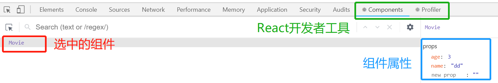

# React.js-Part2

## 0.安装 React Developer Tools 调试工具

[React Developer Tools - Chrome 扩展下载安装地址](https://chrome.google.com/webstore/detail/react-developer-tools/fmkadmapgofadopljbjfkapdkoienihi?hl=zh-CN)

## 主要内容

1. 学习 创建组件的第二种方式
2. 美化React组件的样式
3. 小Demo穿起来之前学习的知识点
4. React中绑定事件

## 1. React中创建组件

### 第1种-创建组件的方法-构造函数

- **使用构造函数来创建组件**，如果要接收外界传递的数据，需要在构造函数的参数列表中使用`props`来接收。

- 必须要向外`return`一个合法的`JSX`创建的虚拟DOM。

- 下列提示，表示构造函数组件缺少返回值，不渲染组件则返回null。

  - ```c
    Nothing was returned from render. This usually means a return statement is missing. Or, to render nothing, return null.	
    ```

- 组件的构造函数的函数名必须首字母大写，否则浏览器当作普通标签渲染。

  ```c
  The tag <hello> is unrecognized in this browser. If you meant to render a React component, start its name with an uppercase letter.
  ```

- 创建步骤

  - 创建组件，使用`props`接收外界传递的数据，组件中接收的props永远都是只读的

    ```jsx
    function Hello(props){ //形参，标签属性构成的对象
        // 如果在一个组件种 return ，一个 null ,则表示此组件是空的，什么都不渲染。
        // return null;
        // 在组件种，必须 返回一个合法的JSX虚拟DOM元素。
        // 无论是Vue 还是React，组件中接收的props永远都是只读的。
        return <div>这是 Hello 组件 {props.name} {props.age} {props.gender}</div>;
    }
    ```

  - 使用组件，为组件传递props数据

    ```jsx
    // 直接把组件的名称，以标签形式，丢到页面上即可。
    ReactDOM.render(<div>
        <Hello name={dog.name} age={dog.age} gender={dog.gender}></Hello>
    </div>, document.getElementById('app'));
    ```

    **使用`{...obj}`属性扩展传递数据（解构赋值）**

  - 使用展开运算符`...`遍历对象属性值，解构赋值

    ```js
    var o1 = {
        age: 22,
        address: "杭州"
    }
    var o2 = {
        name: 'zs',
        ...o2
    }
    ```

    ```jsx
    <Hello {...dog}></Hello>
    ```

    **将组件封装到单独的文件中（组件化）

  - 把组件抽离到单独的`.jsx`文件，（组件要引入React类，否则会报错），

    - 把组件暴露出去。

    ```jsx
    import React from 'react'; // 组件要引入React类，否则会报错
    export default Hello;
    // 或者
    export default function Hello(props){ //形参，标签属性构成的对象
        return <div>这是 Hello 组件 {props.name} {props.age} {props.gender}</div>;
    }
    ```

    - `index.js`页面，引入组件

    ```jsx
    // 默认，如果不做单独的webpack配置，不能省略 .jsx 后缀名
    import Hello from './components/Hello.jsx';
    ```

    ​	**注意**：这里的`@`符号表示项目根目录中`src`这一层根目录。

    ```js
    import Hello from '@/components/Hello.jsx';
    ```

    **省略`import`导入时文件的后缀名**

    - `webpack.config.js`配置，省略`.jsx`后缀名。（默认补全：`extensions: ['.js', '.json']`）

      > 修改完配置文件，需要重新`run`运行。

    `webpack.config.js`中，`module.exports`,`resolve`（解决）与`mode`、`plugins`、`module`平级。

    ```js
    resolve: {
            extensions: ['.js', 'jsx', '.json'] // 表示，import引入时，这几个文件的后缀名可以省略不写，有先后顺序，先试.js文件
    }
    // 默认补全：extensions: ['.js', '.json']
    ```

    **`import`导入时文件路径中有`@`**

    注意：这里的`@`符号表示项目根目录中`src`这一层根目录（需在`webpack.config.js`配置）。

    ```js
    import Hello from '@/components/Hello.jsx';
    ```

    `resolve`下的`alias`（表示别名，本身就以`s`结尾）

    ```js
    const path = require('path');//引入了 path
    module.exports = {
        resolve: {
            extensions: ['.js', '.jsx', '.json'], 
            alias:{
                '@': path.join(__dirname, './src') 
                // 这样，@ 就表示项目根目录中 src 的这一层路径
            }
        }
    }
    ```

### 第2种-创建组件的方法-class

**使用`class`关键字来创建组件**

#### 了解 ES6 中 `class`关键字的特性

- class 中 `constructor` 的基本使用
- 实例属性和实例方法
- 静态属性和静态方法
- 使用 `extends` 关键字实现继承

##### 1.`class`创建类

- 【实例属性】：通过 new 出来的实例，访问到的属性，叫做实例属性。
- 【静态属性】：通过构造函数/类**直接**访问到的属性，叫做静态属性。

**构造函数创建对象**

```js
function Person(name, age){
    // 实例属性
    this.name = name;
    this.age = age;
}
// 静态属性：info属性，直接挂载给了构造函数constructor，不在原型（prototype）对象上，所以它是静态属性
Person.info = 'Person构造函数的静态属性';
// 实例方法（挂载到原型上）
Person.prototype.say = function(){
    console.log('Person构造函数挂载到原型对象上的实例方法');
}
// 静态方法
Person.show = function(){
    console.log('Person构造函数的静态方法');
}
const p1 = new Person('Person构造函数的实例属性', 18);
console.log(p1.age);
console.log(Person.info);
```


**class创建对象**

- 注意点
  - 注意1：在 `class `的`{}`区间内，只能写构造器、静态方法和静态属性、实例方法
  - 注意2：`class`关键字还是原来的构造函数的方式实现的，所以，我们把`class`关键字称作**语法糖**
    语法糖，程序员使用起来比较顺手、方便，实际上本质没有改变。
- 类中必须有构造器函数，不用声明内部成员变量，每一个类中都一个构造器
  - 没有显示指定构造器，则类的内部默认有一个空构造器
  - 构造器的作用，new 这个类的实例时，执行构造器中的代码进行初始化

```js
class Animal {
    // var str = '111';//不能写
    constructor(name, age){
        // 实例属性：通过 this 分配的属性也叫实例属性
        this.name = name;
        this.age = age;
    };
    // 静态属性，在构造器/类上
    static info = "Animal类的静态属性";
    // 实例方法(挂载到原型对象上的实例方法)
    // 经常用实例方法
    talk(){
        console.log('Animal类挂载到原型对象上的实例方法');
    }
    // 静态方法（类的静态方法）
    static show(){
        console.log("Animal类上的静态方法");
    }
}
const a1 = new Animal('Animal的实例属性', 3);
console.log(a1.age);
a1.talk();
Animal.show();
```


##### 2.使用extends实现子类继承父类

**原型链继承：**

```js
function SupSuper(){
 this.name = "Subsuper超父类 实例属性"
}
SupSuper.prototype.info ="Subsuper超父类 prototype 属性"
function Super(){
    this.name = "super父类 实例属性"
}
Super.prototype = new SupSuper();
Super.prototype.info = "继承后加的super父类 prototype 属性";
function Sub(){
}
Sub.prototype = new Super();
const sub = new Sub();
console.log(sub); 
```


确定原型和实例的关系：

- 用`instanceof `：`sub instanceof Sub`、`sub instanceof Super`、`sub instanceof SupSuper`

- 用`isPrototypeOf`：`Sub.prototype.isPrototypeOf(sub)`、`Super.prototype.isPrototypeOf(sub)`、`SupSuper.prototype.isPrototypeOf(sub)`、`Object.prototype.isPrototypeOf(sub)`

**`class`继承：**

```js
// class 子类 extends 父类
// 公共方法
// 这是父类
class Person {
    constructor(name, age){
        this.name = name;
        this.age = age;
    }
    // 实例方法
    sayHello(){
        console.log('Hello');
    }
}
class American extends Person{
    constructor(name, age){
        super(name, age);
    }
}
const a1 = new American('Jack', 20);
class Chinese extends Person{
    constructor(name, age, id){ // 中国人特有的id
        super(name, age); // 这些规则在ES2015中已经规定了，必须在子类中调用super，否则this无法使用
        this.id = id; // 必须写在super之后
    }
}
const c1 = new Chinese('张三', 21, 3303820000000000);
```

-  如果一个子类通过 `extends` 关键字继承了父类，那么，子类的`constructor`构造函数种，必须优先调用一下`super()`。**必须在子类中调用super，否则this无法使用**

```c
missing super() call in constructor
```

-  `super`是父类构造器函数，在子类中，`super`是父类 `constructor `构造器的一个引用。

#### 基于class关键字创建组件

最基本的组件结构：

- 如果使用`class`定义组件，必须让自己的组件，继承 React.Component（也是一个类）

- `render` 函数（`class`的一个实例方法）的作用是渲染当前组件对应的虚拟DOM元素

```jsx
class 组件名称 extends React.component { //这里！！！！
    // 在 组件内部，必须有 render 函数
    render(){
        //render 函数中，必须返回合法的 JSX 虚拟DOM结构，或者null
        return <div>这是 class 创建的组件</div>
    }
}
```

- 在 `class` 关键字创建的组件中，如果是使用外界传递过来的 `props` 参数，不需要接收，直接通过 `this.props.***` 访问即可
- `this`表示什么：类的`this`，指向当前组件（类）的实例对象
- 无论是 `class` 还是普通 `function`创建的组件，它们的 `props` 都是只读的

```jsx
// 或者，按需导入类
import React, {Component} from 'react'; 
// class 关键字创建组件
class Movie extends Component {
    // render 函数的作用是渲染当前组件对应的虚拟DOM元素
    render(){
        return <div>Movie实例 {this.props.name} {this.props.age}</div>;
    }
}
const dog = {
    name: "dd",
    age: 3,
    gender: 'male'
};
ReactDOM.render(<div>
    {/* 这里的 Movie 标签，实际上是 Movie 类的一个实例对象 */}
    {/* <Movie name={dog.name} age={dog.age}></Movie> */}
    <Movie {...dog}></Movie> {/* 展开运算符 */}
</div>, document.getElementById('app'));
```

## 2.两种创建组件的方式对比

> 注意：使用 class 关键字创建的组件，有自己的私有数据**（`this.state`）** 和 生命周期函数；
>
> 但是使用 function 创建的组件，只有props，没有自己的私有数据和 生命周期函数；

1. 用**构造函数**创建出来的组件：叫做“无状态组件”【无状态组件今后用的不多】

2. 用**class关键字**创建出来的组件：叫做“有状态组件”【今后用的最多】

   

   ```jsx
   class Movie extends Component {
       // 构造器
       constructor(){
           super(); // 只有调用了 super() 以后，才能使用 this 关键字
           this.state = { // this.state() 相当于 Vue 中的 data(){ return { } }
               msg:' Hello '
           } // 可读可写
       }
       render(){
           this.state.msg = "dddd"; // 可读可写
           return <div>
               Movie实例 {this.props.name} {this.props.age} 
               <h1>{this.state.msg}</h1>
           </div>;
       }
   }
   ```

3. 什么情况下使用有状态组件？什么情况下使用无状态组件？

   - 如果一个组件需要有自己的私有数据，则推荐使用：`class`创建的有状态组件；
   - 如果一个组件不需要有私有的数据，则推荐使用：无状态组件；
   - React官方说：无状态组件，由于没有自己的state和生命周期函数，所以运行效率会比 有状态组件稍微高一些；

有状态组件和无状态组件之间的**本质区别**就是：有无state属性、和 有无生命周期函数；

4. 组件中的 `props` 和 `state/data` 之间的区别
   - `props `中的数据都是外界传递过来的（父组件）；
   - `state（React）/data（Vue）` 中的数据，都是组件**私有的**；（通过 **Ajax** 获取回来的数据（走网络），一般都是私有数据）；
   - `props`  中的数据都是只读的；不能重新赋值；
   - `state/data` 中的数据，都是可读可写的；

## 3.渲染简单的评论列表


- 整个列表：父组件；每一行：子组件。

- 评论项对应的数据，放到父组件中的私有数据。

- 先创建父组件，使用`class`，再创建抽离出子组件，使用构造函数。

- 将评论`item`项抽离为单独的CmtItem组件，组件内部`div`的`key`无意义了，需写在`CmtItem`标签上。

- 把评论列表和评论项抽离为单独的组件。`CmtItem.jsx`、`CmtList.jsx`

  ```jsx
  export default class CmtList extends Component{}
  ```

- 导入 评论项 子组件，`./`导入文件路径的注意点。

  使用`@`符号代替相对路径的好处：被解析为绝对路径。
  

## 4.列表设置样式

### 1.设置行内样式

`<h1 style="color:red">这是评论列表主键</h1>`，报错：

```
The `style` prop expects a mapping from style properties to values, not a string. For example, style={{marginRight: spacing + 'em'}} when using JSX.
```

在 JSX 中，对于行内样式，不能为`style`属性设置字符串值。

应该写成：

​	`style={{ color: 'red', fontSize: '24px', zIndex: 2}}`

​	`style={{ border:"1px solid #ccc",boxShadow:"0 0 10px #ccc"}}`

> box-shadow : x偏移量 y偏移量 扩散量 颜色

- JS中，`{}`花括号代表对象

- 对象中，用连字符`-`可以，但是需要用单引号包裹，`'font-size'`，写成上面驼峰命名方式也行。

- 行内样式中，如果是数值类型的行内样式，则可以不用引号包裹；

  如果是字符串类型的样式，必须使用引号包裹。

封装成样式对象：（样式对象和`UI`结构分离）

```jsx
const style = {
    item : {border:"1px solid #ccc",boxShadow:"0 0 10px #ccc"},
    user : { fontSize: '14px'}
}
```

抽离样式对象到外部文件（抽离为单独的样式表模块）：

`style.js`

```js
export default {
    item : {border:"1px solid #ccc",boxShadow:"0 0 10px #ccc"},
    user : { fontSize: '14px'}
}
```

```jsx
import style from "@/components/style.js";
```

### 2.使用css样式表美化组件（Webpack相关）

#### **安装处理 css 样式表的loader**

> webpack 默认只能打包处理 .js 后缀名类型的文件；像`.png`，`.vue` ，`.css`无法主动处理，所有要配置第三方的`loader`；

`npm i style-loader css-loader -D`

（建议先写`style-loader`，再写`css-loader`，配置时有顺序要求。）

`webpack.config.js`

```js
module: { // 所有第三方模块的匹配规则，webpack默认只能打包出js文件，
        rules: [
            { test: /\.js|jsx$/, use: 'babel-loader', exclude:/node_modules/} ,//正则,use:多个用数组，exclude:排除项（千万别忘记添加）
            { test: /\.css$/, use: ['style-loader', 'css-loader']} // 注意顺序
        ] //数组，以 s 结尾的，都是对象
    },
```

- 当程序运行到 webpack 不能处理的文件类型时，到配置的模块中找规则。
- 先交给 css-loader 处理，将处理结果再交给 style-loader 处理，没有其他 loader 了，则交给 webpack 做打包合并。
- `'style-loader'` loader 不能省略，不写的是webpack 1.x版本

```jsx
import cssobj from '@/css/CmtList.css';
// cssobj 是一个空对象，因为css文件没有向外暴露（export）对象
```

```jsx
// 对应的类名
<h1 className="title">评论用户：{props.user}</h1>
```

#### **为普通样式表通过 modules 参数启用模块化** `CmtItem.jsx`

- **CSS样式表作用域冲突的问题**

  经过实验，发现直接导入的 css 样式表，默认是在全局，整个项目都生效的。

  - Vue 组件中的样式表，也有冲突的问题，但是可以使用`<style scoped></style>` scoped指令解决。
  - React 中没有类似于 scoped 这样的指令的概念。

- `webpack.config.js`规则追加参数：类似于`?name=zs&age=21`
  - 可以再 css-loader 之后，通过 ? 追加参数。
  - 其中，固定参数 modules，表示为普通的css样式表，启用模块化
  - css 模块化只针对 类选择器 和 ID选择器生效；不会将标签选择器模块化

```js
module: { // 所有第三方模块的匹配规则，webpack默认只能打包出js文件，
        rules: [
            { test: /\.js|jsx$/, use: 'babel-loader', exclude:/node_modules/} ,
            { test: /\.css$/, use: ['style-loader', 'css-loader?modules']}
        ] //数组，以 s 结尾的，都是对象
    },
```

​	在为普通样式表通过 modules 参数启用模块化之前，cssobj 是一个空对象，css文件没有向外暴露（export）对象。启用模块化之后，不再是个空对象。

```js
import cssobj from '@/css/CmtList.css';
console.log(cssobj);
// 在为普通样式表通过 modules 参数启用模块化之前，cssobj 是一个空对象，css文件没有向外暴露（export）对象
// 启用模块化之后，不再是个空对象。
```


```css
.title{
    font-size: 14px;
}
#cmtTitle {
    font-size: 14px;
}
```


#### **使用`localIdentName`自定义生成的类名格式**

可选的参数有：（css-loader v2.1.1 可以，目前【2019.10】最新v3.2）

- [path]  表示样式表 `相对于项目根目录` 所在路径

- [name]  表示 样式表文件名称

- [local]  表示样式的类名定义名称

- [hash:length]  表示32位的hash值（取5位基本不会重复）

- 例子：`{ test: /\.css$/, use: ['style-loader', 'css-loader?modules&localIdentName=[path][name]-[local]-[hash:5]'] }`

  > 异常报错如下 Invalid options object. CSS Loader has been initialised using an options object that does not match the API schema.
  >
  > 翻了下文档,以及github，发现css-loader 因为版本的更新（version3.x）已经不支持这样直接写入localIdentName

`npm i  css-loader@2 -D`下载之前的版本，2.1.1可以了。


#### **使用 `:local()` 和 `:global()`**

- `:local()`包裹的类名，是**被模块化**的类名，只能通过`className={cssObj.类名}`来使用

  同时，`:local`默认可以不写，这样，默认在样式表中定义的类名，都是被模块化的类名（前提是，css-loader中设置开启模块化）；

  ```jsx
  {/* <h1 className={cssobj.title + " test"} >评论用户：{props.user}</h1> */}//并列的类
      <h1 className={[cssobj.title, "test"].join(" ")} >评论用户：{props.user}</h1>
  ```

- `:global()`包裹的类名，是全局生效的，不会被 `css-modules` 控制，定义的类名是什么，就是使用定义的类名`className="类名"`

  ```css
  :global(.test){
      font-style: italic;
      color : red;
  }
  ```

注意：只有`.title`这样的**类样式**选择器，才会被模块化控制，类似于`body`这样的**标签**选择器，不会被模块化控制。

### 3.在项目中启用模块化并同时使用bootstrap（第三方样式表）

- 安装bootstrap。

  `npm i bootstrap@3.3.7 -S` （最新版Version 4）

- 警告：`.ttf`、`.woff`、`.woff2`、`.eot`、`.svg`等文件不会被处理，需要下载第三方`url-loader`。（`url-loader`内部依赖于一个`file-loader`，最好也装上）像处理图片文件类型一样处理。

```c
node_modules/bootstrap/dist/fonts/glyphicons-halflings-regular.ttf 1:0
Module parse failed: Unexpected character ‘ ' (1:0)
You may need an appropriate loader to handle this file type, currently no loaders are configured to process this file.
```

```c
npm i url-loader -D
npm i file-loader -D
```

```jsx
import bootcss from 'bootstrap/dist/css/bootstrap.css';
console.log(bootcss);
```

​	模块化的css引入形式：


```jsx
<button className={[bootcss.btn, bootcss["btn-primary"]].join(" ")}> {/*很麻烦*/}
```

- 把自己的样式表，定义为 `.scss`  文件；第三方的 样式表，还是 以 `.css` 结尾；我们只需要为自己的 `.scss/.less` 文件，启用模块化即可；**（安装失败！！！！）**

  ```c
  npm i sass-loader node-sass -D
  ```

  添加loader规则：`webpack.config.js`（配置文件更好后需要重新启动）

  ```js
  { test: /\.scss$/, use: ['style-loader', 'css-loader?modules&localIdentName=[path][name]-[local]-[hash:5]', 'sass-loader'] } // 打包处理 scss 文件的 loader
  ```

## 5.React 中绑定事件的注意点 `BindEvent.jsx`

- 有关在构造函数中调用自己的方法：

  ```js
  function Person(){
  
  }
  Person.prototype.say = function(){}
  Person.prototype.show = function(){
      this.say(); // 调用实例方法要加this
  }
  ```

1. 事件的名称都是React的提供的，因此名称的首字母必须大写`onClick`、`onMouseOver`

2. 为事件提供的处理函数，必须是如下格式

   ```
   onClick= { function }
   ```

3. 用的最多的事件绑定形式为：

   ```jsx
   <button onClick={ () => this.show('传参') }>按钮</button>
   
   // 事件的处理函数，需要定义为 一个箭头函数，然后赋值给 函数名称
   show = (arg1) => { // 这里
       console.log('show方法' + arg1)
   }
   ```

   ```jsx
   <button onClick={this.myclickHandler}>按钮</button>
   {/* 调用自己的方法，也要加this，不能加()，把引用赋值给点击事件 */}
   {/* <button onClick={ ()=> {this.myclickHandler()}}>按钮</button> */}
   ```

   ```jsx
   // 这是一个实例方法
   myclickHandler = ()=>{
       console.log("ok");
   }
   ```

4. 在React中，如果想要修改 state 中的数据，推荐使用 `this.setState({ msg = '123'})//传递对象`；

   - 在 React 中，如果想为 state 中的数据重新赋值， 不要使用 this.state.*** = '值'。

   -  setState 方法，只会把对应的 state 状态更新， 而不会覆盖其他 state 状态。

   -  setState 方法执行的时候是异步。如果在调用完 this.setState 之后立即拿到最新的 state 值，需要使用 `this.setState({}, callback) // 回掉函数`；设置完成之后会执行回掉函数，则可以拿到最新的值。

     ```jsx
     myclickHandler = (props) =>{
             // console.log("ok "+props);
             this.setState({
                 msg : "new msg"
             })
             console.log(this.state.msg); // 原数据
         }
     ```

     ```jsx
      myclickHandler = (props) =>{
             // console.log("ok "+props);
             this.setState({
                 msg : "new msg"
             }, function(){
                 console.log(this.state.msg); // new msg
             })
         }
     ```


### 箭头函数

箭头函数是匿名是 function ，只是内部的 this 指向有点特殊，与外层 this 保持一致。

事件监听函数中的this指触发事件的对象。

匿名函数内部this默认指向全局对象window。es6为严格模式下, 在函数内部不会乱指window的，为undefined。

```js
'use strict';
function func(){
    return function(){
        console.log(this);
    }
}
func()(); // undefined
function func2(){
    return ()=>{
        console.log(this);
    }
}
func2()(); // undefined
(()=>{
    console.log(this);
})(); // window
var name = 'dd';
console.log(this);// window
```


```js
btn.onclick = function(){
	// this 指向btn，事件监听函数中的this指触发事件的对象。
}
btn.onclick = () => {
	// 箭头函数的内部永远指向外一层的this
}
setTimeout(function(){
	// this 指向 window
}, 1000);
```

```html
<button id="btn">按钮</button>
    <script>
        onload = function(){
            const btn = document.getElementById('btn');
            btn.onclick = function(){
                this.style.backgroundColor = 'red'; // this指向btn
            }
            console.log(this); // window
            btn.onclick = () =>{ //箭头函数
                this.style.backgroundColor = 'red'; // this指window
            }
            /////////////////
            btn.onclick = function(){
                window.setTimeout(function(){
                    this.style.backgroundColor = 'red'; // this永远指向window
                }, 1000)
            }
            btn.onclick = function(){
                window.setTimeout(() => {
                    this.style.backgroundColor = 'red'; // this外层的this，即btn
                }, 1000)
            }            
        }
    </script>
```

> 在构造函数 constructor 中，**通过 this 分配的所有属性都是实例属性**。

> 折叠注释代码块：输入`#`，有自动提示
>
> //#regoin
>
> //...
>
> //#endregion
>
> 

## 6.绑定文本框与state中的值（单向数据流）


> 注：Vue 的双向数据绑定：
>
> 状态里的值改变会同步到页面上的文本框，文本框值的改变会同步到状态。
>
> 在 Vue 中，默认提供了`v-model`指令，可以很方便的实现 `数据的双向绑定`；

```
Failed prop type: You provided a `value` prop to a form field without an `onChange` handler.
This will render a read-only field. If the field should be mutable use `defaultValue`. Otherwise, set either `onChange` or `readOnly`.
```

译：

如果我们只是把文本框 value 属性，绑定到了 state 状态，但是，如果不提供 onChange 事件，会得到一个只读文本框。

当为文本框绑定 value 值之后，要么同时提供一个 readOnly 属性，要么提供一个onChange 处理函数。

**React 数据同步过程：**


### 单项数据流

默认情况下，如果页面上的表单元素绑定了 state 上的状态值，则当 state 上状态值变化，会自动把最新的状态值同步到 UI 界面上。

当 UI 界面上文本框内容变化了，React 中没有这种自动同步的机制，想要把最新的值同步到 state 中，需要：

- 手动监听文本框的 onChange 事件

- 在 onChange 事件中，拿到最新的文本框的值。在 onChange 事件中，获取文本框的值，有两种方案：
  - 方案1：通过事件参数 e 来获取。e.target（DOM对象）

  - 方案2：获取元素的引用`this.refs.引用名称`

    元素上增加 ref 属性。
    
    ```jsx
     <input type="text" ref="txt" value={this.state.msg} onChange={ (e)=>this.txtChanged(e)}></input>
    ```
    
    ```jsx
    txtChanged = (e) => {
            // console.log(e.target.value);
            // console.log(this.refs.txt.value);
        	this.setState({
                msg : e.target.value
            })
    }
    ```
  
- 用 this.setState({ }) 同步到状态state中。

## 7. 使用ref获取DOM元素引用

和 Vue 中差不多，vue 为页面上的元素提供了 `ref` 的属性，如果想要获取 元素引用，则需要使用`this.$refs.引用名称`

在 React 中，也有 `ref`, 如果要获取元素的引用`this.refs.引用名称`

元素上增加 ref 属性。例：上述【方案2】

